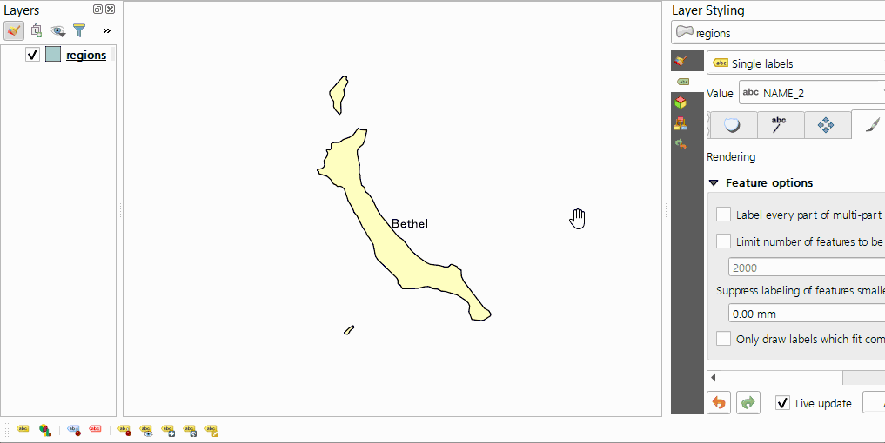

# Convert Labels

This QGIS plugin converts labels of the vector layer into a layer for annotation. The destination can be a GeoPackage point layer or an annotation layer supported from QGIS 3.22. For multiparts, create points for each part depending on the layer style settings. It runs from the context menu of the vector layer in the Layers panel.

